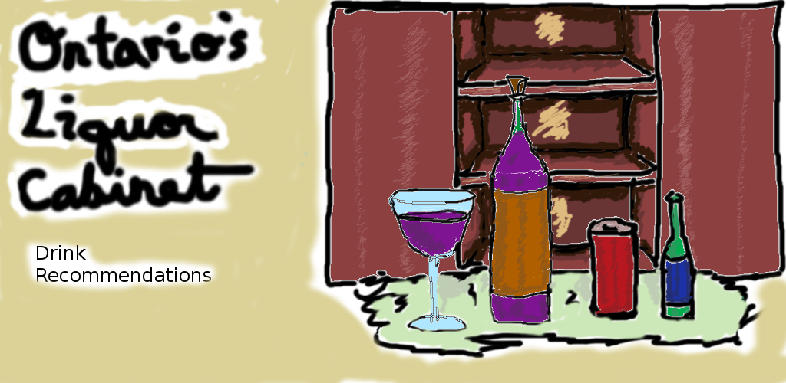

# Ontario's Liquor Cabinet

Ontario's Liquor Cabinet recommends new drinks in Ontario!

- explore the Liquor Control Board of Ontario (LCBO) products using handy filtering and sorting parameters!

- view detailed product information on drinks you are interested in!

- check the availability of drinks at stores close to you!

- easily rate products by simply swiping left and right!

- view a log of past ratings to track drinks you'd like to remember!

- receive recommendations for new drinks you haven't yet rated!

[Available on Google Play](https://play.google.com/store/apps/details?id=com.games.garrett.theliquorcabinet)

## The Recommendation System

This app uses a [content based recommendation system](https://en.wikipedia.org/wiki/Recommender_system#Content-based_filtering) to provide recommendations. This was chosen to avoid a [cold start](https://en.wikipedia.org/wiki/Cold_start). The design was created to be extensible, such that a transition to a [collaborative based recommendation system](https://en.wikipedia.org/wiki/Recommender_system#Collaborative_filtering) would be possible.

The recommendation system was developed using the [WAMP](https://en.wikipedia.org/wiki/WAMP_(disambiguation)) stack and deployed to the cloud using [Heroku](https://www.heroku.com/). An item profile was created by iterating through all products available through the [LCBO API](https://lcboapi.com/) at the time, and extracting the tags for each item. This was represented  in the MySQL database as [many-to-many relationship](https://en.wikipedia.org/wiki/Many-to-many_(data_model)). The tags were weighted using methods outlined [here](https://www.analyticsvidhya.com/blog/2015/08/beginners-guide-learn-content-based-recommender-systems/).

When a user rates an item, their rating is stored in a table with their unique user ID, the product ID of the item they rated, and the rating they gave. This tracking of a user ID allows for the design to be extended into a collaborative recommendation system.

## Android Components

This app uses key Android components to achieve its objectives:

- Activities
- Fragments
- Services
- Content Providers
- Broadcast Receivers

In particular:

### Activities 

This app uses activities for single user facing operations. The activities in this app are: 

1. MainActivity 
   - lets the user navigate to the other activities in the app
2. BrowseActivity
   - lets the user input query parameters and displays the results returned from the LCBOService 
3. DetailsActivity 
   - shows the details of a particular LCBO product, including local inventories
4. QuickRateActivity
   - randomly shows the user LCBO products to rate. This allows the user to quickly establish a user profile
5. RecommendationActivity
   - shows the user a list of recommended items based on their past ratings
6. LiquorLogsActivity
   - shows the user their past ratings on items with the option to delete particular ratings
6. SettingsActivity
   - lets the user clear all past ratings, and also change the distance the app will search for local stores

### Fragments

This app uses fragments to represent portions of the UI in its activities:

1. DisplayProductsFragment
   - Displays paginated lists returned from the services to the user. It allows the user to swipe left or right on an item to rate it, or to touch an item to launch the DetailsActivity
2. RatingFragment
   - displays lists of items that the user has previously rated. It allows the user to either view the details or delete items

### Services 

This app uses services for long running operations.

1. LCBOService
   - interactions with the LCBO API are done through this service
2. RecommendationService
   - interactions with the recommendation database are done through this service

### Content Providers

This app uses content providers to track persistent information.

1. LCBOProductRatingsProvider
   - tracks user ratings to be displayed in the LiquorLogsActivity

